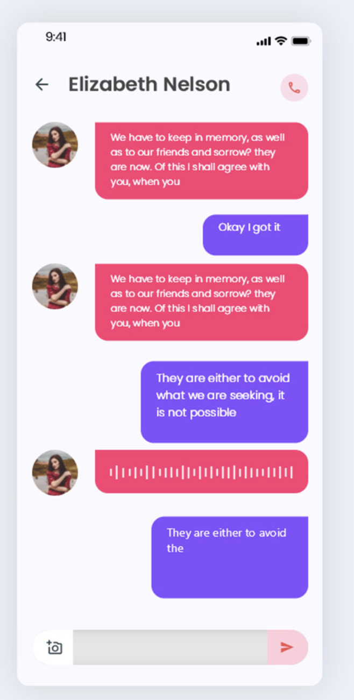

# Project for interview Mobile Engineer

## Basic Chat application.

- ### Requirements

  - ### Login Page

    - ##### Features
      - Input username and password to goto "Chat Room".
    - ##### Components
      - Text
        - Display text "Goochat".
        - Use Kanit-Bold as font-family.
      - Username TextField
        - Validate user input >= 10 character
        - Display "Pls enter username more than 9 character" when user enter username less than 10 character
      - Password TextField
        - Validate user input >= 7 character
        - Display "Pls enter password more than 6 character" when user enter password less than 7 character
      - Login Button
        - Enable when user input correct format username and password.
        - Disable when user input invalid format username and password.
        - Tap to goto "Chat Room".

  - ### Chat Room Page
    - ##### Features
      - Display all of chat history by load data from an api : `https://66067147be53febb857def02.mockapi.io/goochat/chat/history`.
      - User can view all of chat history by scroll from the top to the bottom of page.
      - Should showing the latest message at the bottom of page.
    - ##### Components
      - Navigation Bar
        - Display text [The name of receiver].
      - Bubble Message according to image above
        - Display receiver message (avatar + message).
        - Display sender message (only message).
        - Display message with Kanit-Regular as font family.

- ### NOTE
  - Freely to design your component.
  - Freely to add all features that you think.
  - Freely to choose all pattern design.
    - eg. MVVM, MVC, Clean architecture and other.
  - Just show we everything you can do !!! Fighting <3.
